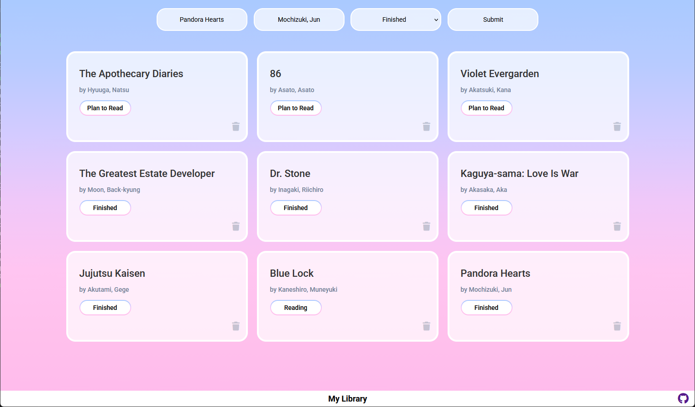

# 📚 My Library App  

A simple and clean **Library Management App** built as part of **The Odin Project** curriculum.  

---
## 🚀 Live Demo  

👉 [Live Demo](https://hellopiyushlab.github.io/Library/)  

---
This project helped me practice:

✅ JavaScript objects & arrays  
✅ DOM manipulation  
✅ Event delegation  
✅ CSS Grid & Flexbox  
✅ Basic app state handling  

---

## 🧠 Features  

✨ Add new books with title, author, and status  
✨ Display books as responsive cards  
✨ Change reading status by clicking on it  
✨ Delete books instantly  
✨ Clean UI with gradient background  
✨ Fixed footer with GitHub link  

---

## 🛠️ Built With  

- HTML5  
- CSS3 (Flexbox + Grid)  
- JavaScript (Vanilla JS)  
- Font Awesome Icons  

---

## 📚 What I Learned  

- How to use **constructor functions** to create objects  
- Storing and managing data in an **array of objects**  
- Updating UI by iterating over data  
- Using **event bubbling & delegation** efficiently  
- Handling form submission without page reload  
- Creating reusable DOM elements with JS  

---

## 📝 To-Do  

- [ ] Add localStorage support (save books on refresh) 
- [ ] Add cloud database support 
- [ ] Add edit book title/author feature  
- [ ] Add search/filter functionality  
- [ ] Improve mobile responsiveness  
- [ ] Add animations for adding/removing cards  
- [ ] Dark mode 🌙  

---

## 🎯 Part of  

This project is part of **The Odin Project - JavaScript Course**  

---
